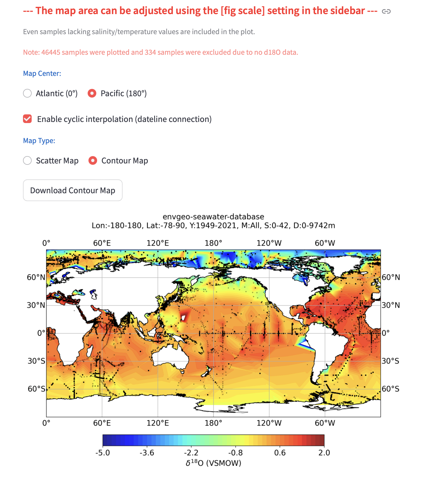
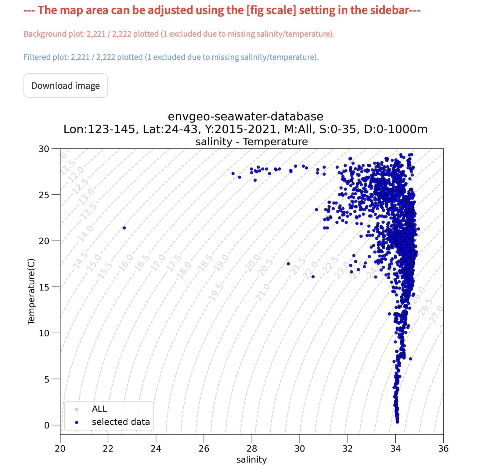
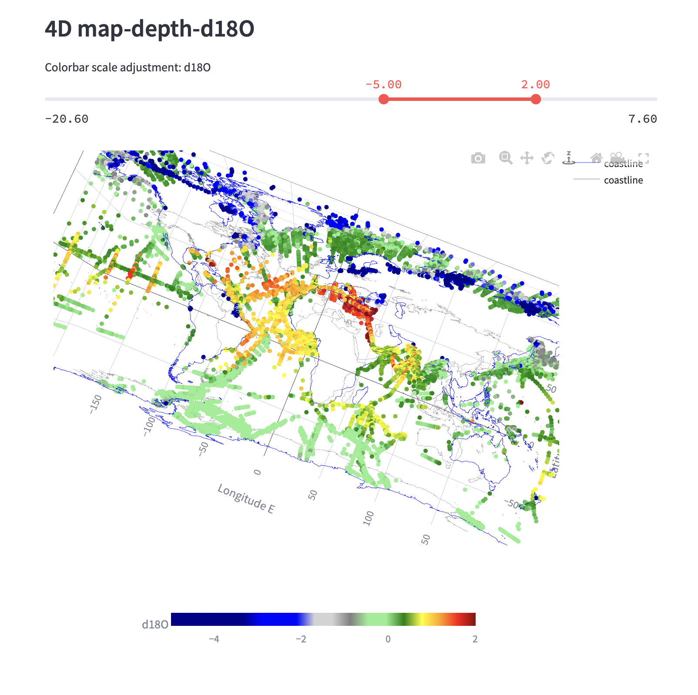
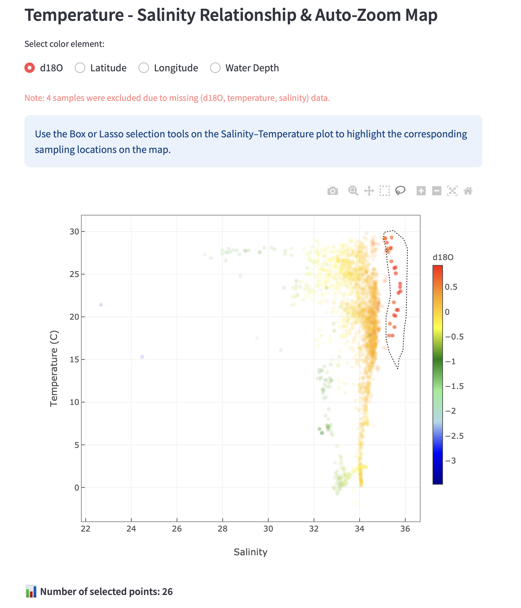
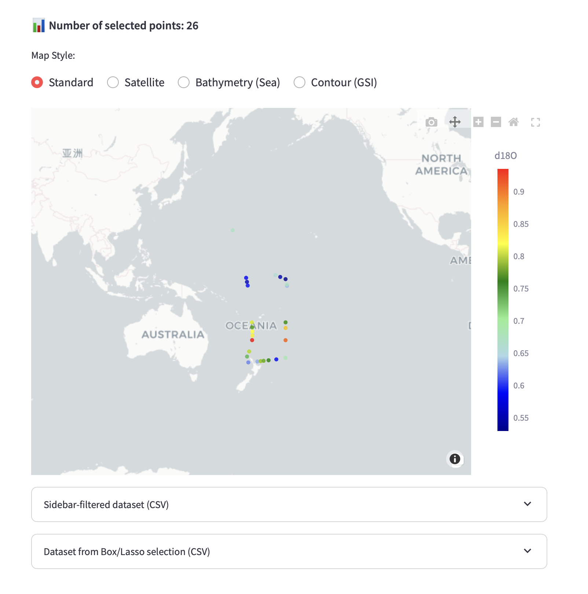

# EnvGeo-Seawater 🌊

EnvGeo-Seawater is an interactive platform for exploring seawater isotope and hydrographic data.

This software has been actively developed since April 2023.

In the previous submission, a newly organized repository was used, which did not reflect the full development history. We now provide the original repository with complete development history, demonstrating continuous and iterative development.

We have also improved repository structure, documentation, and open-source practices accordingly.


[](https://envgeo.h.kyoto-u.ac.jp/sw_jpn/)
[](https://www.python.org/)
[](LICENSE)

**An interactive platform for exploring seawater isotope and hydrographic data.**

This repository accompanies the JOSS submission.

---

## Overview

EnvGeo-Seawater is actively used for exploratory analysis of seawater isotope datasets in marine geochemistry research.

EnvGeo-Seawater is a web-based interactive visualization platform for marine geochemical and hydrographic datasets, including stable water isotopes (δ¹⁸O, δD), salinity, temperature, and depth.

It integrates curated regional datasets (e.g., around Japan) and major global datasets (~50,000 records), enabling consistent cross-comparison under unified analytical conditions.

The platform is designed to support both **exploratory data analysis** and **reproducible research workflows** in marine geochemistry and oceanography.

---

## Key Features

- 🌍 Interactive map visualization with adaptive zoom  
- 📊 Depth profiles with gap-aware plotting  
- 📈 Temperature–Salinity (T–S) diagrams with density contours (σθ)  
- 📉 Regression analysis (e.g., salinity–δ¹⁸O relationships)  
- 🧭 3D / 4D visualization of spatial–temporal structures  
- 📂 User data upload for comparison with reference datasets (currently limited functionality)
- 🧾 Transparent data handling (filtered / excluded samples clearly reported)  
- 🖼️ Export of publication-quality figures  

---

## User Data Integration

`91_USER_UPLOAD_UNPUB.xlsx` is provided as a template for user-defined comparison data.

- Replace the sample rows with your own measurements  
- Keep the same column structure  
- Run the app locally to integrate your dataset  

This allows direct comparison between user datasets and curated reference datasets across all supported visualizations.

---

## Why this tool?

EnvGeo-Seawater enables integrated exploration of isotope and hydrographic data, which are typically analyzed separately.

Unlike conventional tools that treat datasets and visualization separately, EnvGeo-Seawater provides an integrated, interactive framework for exploring isotope–hydrographic relationships and enables direct comparison with user-provided data.

- Integrated multi-parameter visualization  
- Consistent filtering across datasets  
- Direct comparison between user data and curated datasets  
- A unified analytical framework across regional and global datasets  

---

## Data Characteristics

The platform includes internally consistent datasets (e.g., around Japan) analyzed under unified criteria, enabling rigorous cross-comparison.

A key strength is that a substantial portion of the regional datasets (around Japan) has been analyzed by the author using consistent analytical protocols, ensuring high comparability across sampling campaigns.

In particular, regional datasets curated by the author provide:

- Consistent analytical methods  
- Harmonized data structure  
- High comparability across sampling campaigns  

This ensures that observed patterns reflect environmental signals rather than methodological differences.

---

## Data Availability

All datasets included in this repository are either publicly available or redistributed in accordance with their respective licenses.

- Provided in a standardized format for immediate use  

Unpublished or restricted datasets are **not included**.

---

## Installation & Requirements

This project requires **Python 3.12** for full compatibility with validated dependencies.
Due to specific library dependencies (scikit-learn 1.8.0+), Python 3.10 and below are not supported.

### 💡 Special Note for macOS (Apple Silicon) Users:
To avoid build errors with geospatial libraries, it is highly recommended to use **Conda** to install core dependencies before running pip:

```bash
# 1. Create and activate environment
conda create -n envgeo python=3.12
conda activate envgeo

# 2. Install pre-built geospatial binaries
conda install -c conda-forge proj pyproj cartopy -y

# 3. Install remaining requirements
pip install -r requirements.txt
```

---

## Quick Start

```bash
git clone https://github.com/envgeo/seawater_map.git
cd seawater_map
pip install -r requirements.txt
streamlit run home.py
```
Then open the local URL shown in the terminal (typically http://localhost:8501).

---

## Directory Structure

- home.py             : Main application entry point
- envgeo_utils.py     : Utility functions
- pages/              : Streamlit app pages
- data/               : Curated datasets for the application
- dataset/            : Curated seawater datasets
- data_text/          : Text resources (about, references, manuals)
- images/             : Figures and example outputs
- coastline/          : Coastline data (mapping utilities)


---

## Usage

1. Select a dataset (Japan Sea / Around Japan / Global)  
2. Apply filters (location, depth, time, parameters)  
3. Explore:  
   - Maps  
   - T–S diagrams  
   - Depth profiles  
   - Regression plots  
4. Upload your own data for comparison (optional)  
5. Export figures  

---

## Reproducibility

This repository contains:

- The full source code of the visualization platform  
- All required public datasets (lightweight, <30 MB total)  
- A template for user-defined data integration  

Therefore, all figures and analyses generated by this platform are **fully reproducible** in a local environment.

All figures can be reproduced by running the application locally using the provided datasets and following the Quick Start instructions above.

Due to the interactive nature of the application, functionality is validated through manual testing and visual inspection.

Experimental features are included for development purposes and may change in future versions. These features are clearly separated from the core functionalities.

---

## Data Sources

The platform integrates major seawater isotope datasets:

- CoralHydro2k: a global seawater oxygen isotope database (Atwood et al., 2026, ESSD)  
- NASA GISS Global Seawater Oxygen-18 Database (Schmidt et al., 1999)  
- Kodama et al. (2024), *Geochemical Journal*  
- Additional regional datasets  

---

## Live Demo

Primary demo:
https://envgeo-seawater-map.streamlit.app

JOSS-stable demo:
https://envgeo-seawater-pre.streamlit.app

---

## Citation

Ishimura, T. (2026).
EnvGeo-Seawater: An Interactive Platform for Exploring Seawater Isotope and Hydrographic Data.
DOI: (to be assigned)

---

## Examples

EnvGeo-Seawater enables multi-scale exploration of seawater isotope and hydrographic data, from global distributions to detailed interactive analysis.

---

### Global Isotope Distribution (Contour Map)

Spatial distribution of seawater δ18O at the global scale, based on integrated datasets (approximately 50,000 records).  
Contour interpolation highlights large-scale oceanographic patterns and basin-scale variability.



---

### Temperature–Salinity Diagram

Temperature–salinity (T–S) relationships with overlaid density contours (σθ).  
This visualization supports identification of water masses and examination of isotope–hydrography relationships.



---

### 4D Visualization (Longitude–Latitude–Depth–δ18O)

Multi-dimensional visualization of seawater isotope data, incorporating spatial coordinates and depth.  
This allows exploration of vertical structure and spatial gradients simultaneously.



---

### Interactive Selection (Map–T–S Linkage)

Linked visualization between T–S space and geographic location.  
Selected subsets in the T–S diagram are dynamically highlighted on the map, enabling intuitive interpretation of water mass origins.






---

## License

MIT License
