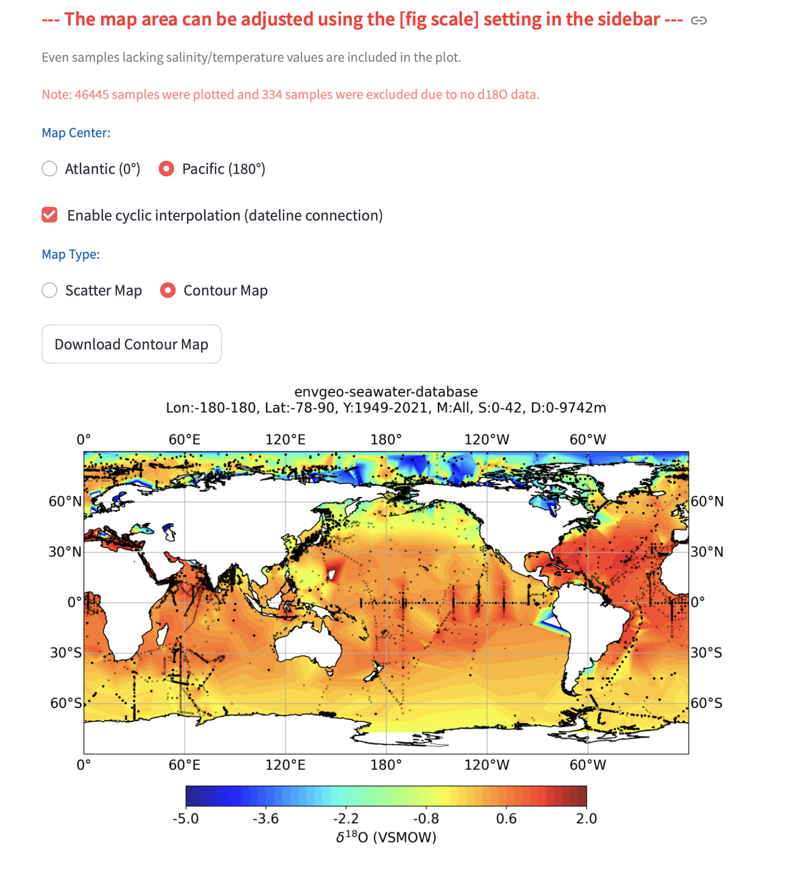
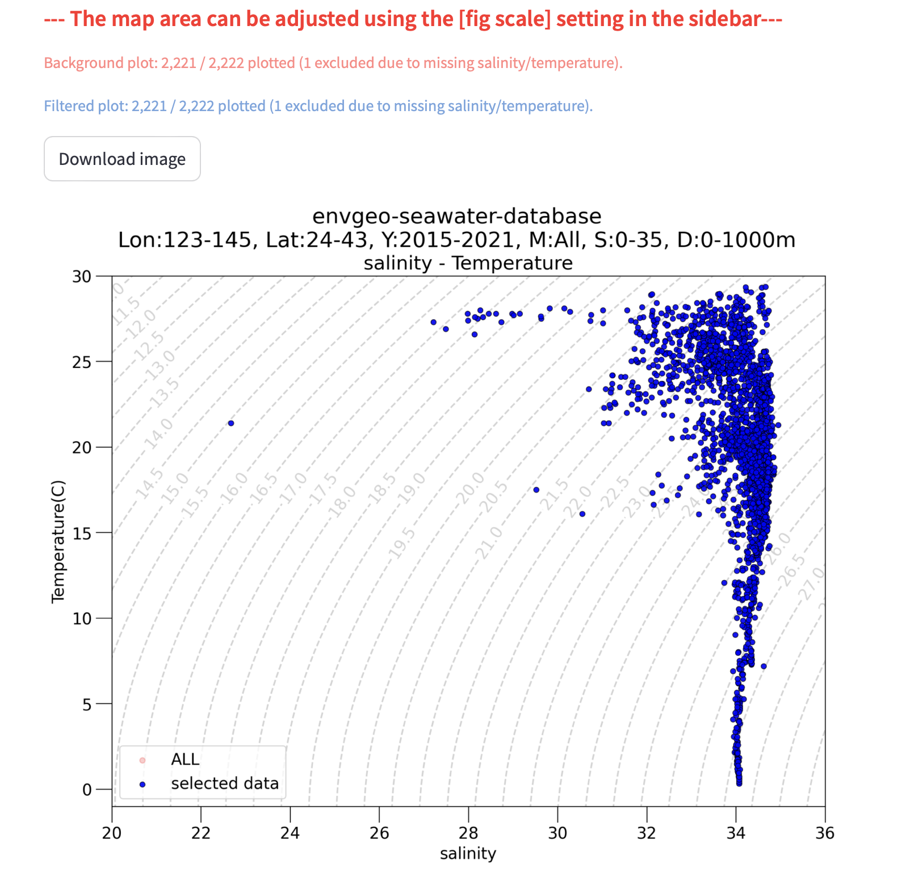
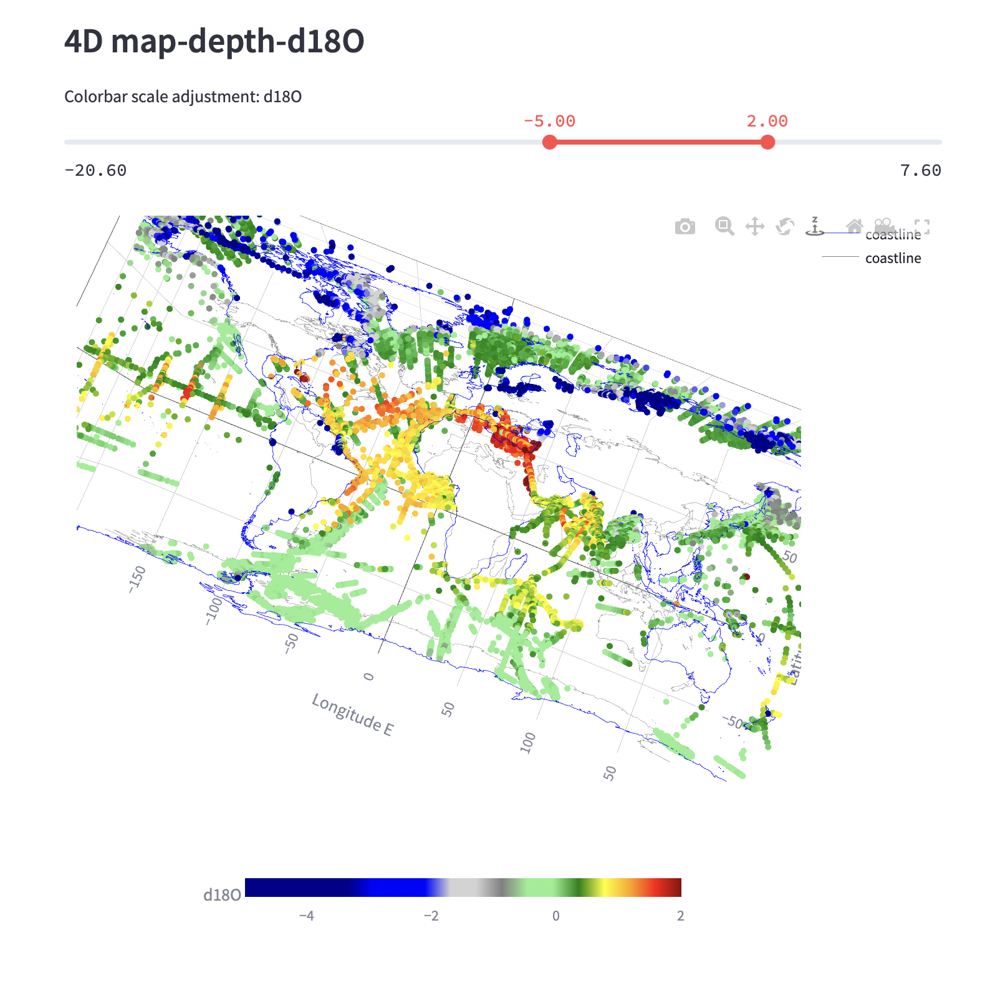
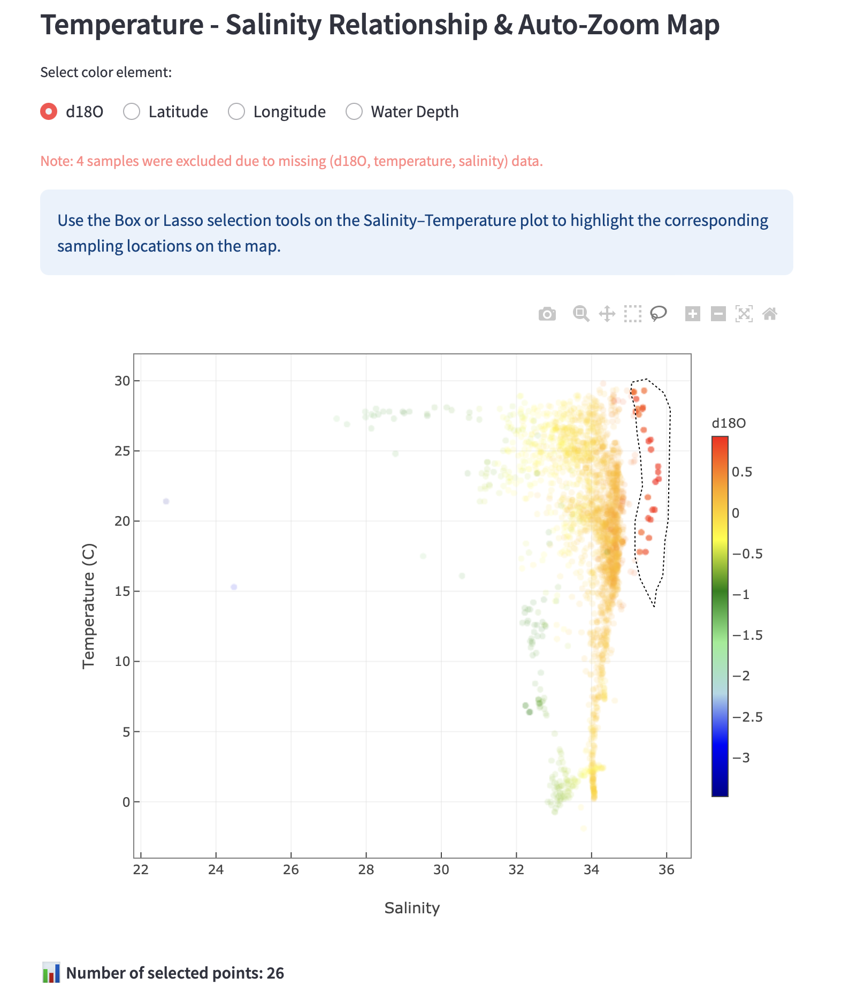
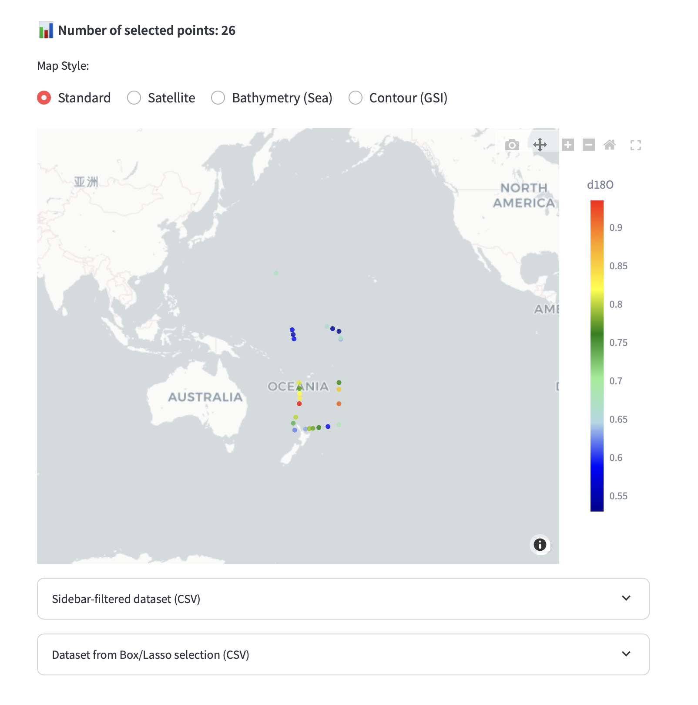

# EnvGeo-Seawater 🌊

EnvGeo-Seawater is an interactive platform for exploring seawater isotope and hydrographic data.

[日本語版 README](README_Japanese.md)

[](https://envgeo.h.kyoto-u.ac.jp/sw_jpn/)
[](https://www.python.org/)
[](LICENSE)

**Current development version:** 1.3.3 (2026-09-23)

**An interactive platform for exploring seawater isotope and hydrographic data.**

---

## Overview

EnvGeo-Seawater has been used for exploratory analysis of seawater isotope datasets in marine geochemistry research.

EnvGeo-Seawater is a web-based interactive visualization platform for marine geochemical and hydrographic datasets, including stable water isotopes (δ¹⁸O, δD), salinity, temperature, and depth.

It integrates curated regional datasets (e.g., around Japan) and major global datasets (~50,000 records), enabling consistent cross-comparison under unified analytical conditions.

The platform is designed to support both **exploratory data analysis** and **reproducible research workflows** in marine geochemistry and oceanography.

---

## Key Features

- 🌍 Interactive map visualization with adaptive zoom  
- 📊 Depth profiles with gap-aware plotting  
- 📈 Temperature–Salinity (T–S) diagrams with density contours (σθ)  
- 📉 Regression analysis (e.g., salinity–δ¹⁸O relationships)  
- 🧭 3D / 4D visualization of spatial–temporal structures  
- 📂 Session-only browser uploads and optional persistent local `User Excel data` for comparison with reference datasets
- 🧾 Transparent data handling (filtered / excluded samples clearly reported)  
- 🖼️ Export of publication-quality figures  

---

## Main Pages

The Streamlit app uses `home.py` for the about, data-source, manual,
update-log, and Japanese information tabs. The `pages/` directory contains the
main visualization tools, along with selected beta and local-development pages:

- `pages/03_[Interactive]_2Dplus_Visualizer.py`
  Interactive 2D/2.5D plots for isotope-hydrographic relationships and selected sample locations.

- `pages/04_[Interactive]_3D_4D_Visualizer.py`
  Interactive 3D/4D seawater visualizer for longitude, latitude, depth, and selected variables.

- `pages/05_User_Data_Check_Quick_Visualizer.py`
  User Data Check & Quick Visualizer for reference and CSV/XLSX upload data. It combines shared filtering, missing-value and quality review, 2D Map, Salinity-d18O, Temperature-Salinity, arbitrary 2D/3D/4D, geographic 3D, and filtered CSV export.

- `pages/31_Salinity-d18O_Relationship.py`  
  Salinity-δ18O relationship plots with optional regression lines.

- `pages/32_Isotope_Hydrographic_Mapping.py`  
  Isotope and hydrographic maps for d18O, dD, d-excess, salinity, and temperature distributions.

- `pages/34_T-S_diagram.py`  
  Temperature-salinity diagrams with density contours.

- `pages/37_Depth_Profile.py`  
  Depth profiles for δ18O, δD, d-excess, temperature, and salinity.

- `pages/35_Custom_Parameter_Plot_beta.py`  
  Experimental custom 2D parameter plots with selectable X axis, Y axis, color, and marker size.

- `pages/80_Correlation_Overview.py`
Archive display of the original hand-written exploratory workflow used during development. It is retained as a development record; no new features are planned.

- `pages/53_Vertical_Section_Visualizer.py`  
  Vertical Section Visualizer beta. This experimental page is used to refine section-line selection, interpolation, bathymetry handling, and vertical-section plotting.

- `pages/90_Integrated_Visualizer_beta.py`  
  Experimental integrated visualizer. It can run the original visualization workflows inside one beta page, temporarily merge uploaded user data into those workflows, and test a shared-filter tab workflow with ocean-region map presets for future integration. The standalone uploader page remains separate because it uses its own upload-first workflow.

- `pages/99_Environment_Check.py`  
  Local-development wrapper for the environment checker. It is useful for local diagnostics but is not intended for the public Streamlit deployment sidebar.

The former standalone about page was merged into `home.py`.

---

## Local Diagnostic Tool

The package includes a local Streamlit-based environment checker. It is intended
for local use when confirming Python paths and installed dependency versions.
The diagnostic results can be exported as CSV or PDF reports:

```bash
streamlit run tools/env_check_streamlit.py
```

For local development, `pages/99_Environment_Check.py` can also expose the same
diagnostic workflow in the Streamlit sidebar. It should be excluded or hidden
from public deployment if the public app should only show visualization pages.

---

## User Data Integration

Use the browser upload controls in the visualization pages to load CSV or XLSX
measurements for the current Streamlit session. The `Data Check & Quick
Visualizer` is the upload-first entry point for quality review and simple
2D--4D exploration; supported specialist pages also expose `Uploaded data` in
their shared Data filtering controls.

For repeated local work, place a researcher-owned workbook at
`local_data/user_data.xlsx`, or set `ENVGEO_LOCAL_USER_DATA_PATH` to a CSV,
XLSX, or XLS file. This is the always-loaded local user table: it is assigned
the dataset name `User Excel data` and combined with each selected reference
source in the same way as the former fixed local workbook. It therefore appears
in Data filtering from app startup without requiring a browser upload. Files
under `local_data/` are excluded from Git.
After replacing or editing the local table, restart Streamlit or clear its data
cache so the updated workbook is read.

The always-loaded `User Excel data` and browser `Uploaded data` are independent.
A browser upload does not overwrite the local workbook; when both categories
are selected, both are combined with the selected reference data.

Browser-uploaded files are handled in memory during the current Streamlit
session only. The app does not save uploads or merged user/reference datasets.

Spreadsheet numbers copied from web pages, PDFs, or other workbooks may contain
invisible Unicode spaces. EnvGeo removes common regular, non-breaking, narrow
non-breaking, and full-width spaces before numeric conversion and normalizes a
Unicode minus sign. Values that still cannot be interpreted as numbers remain
missing rather than being guessed. The same normalization is used for the
always-loaded local table and browser uploads.

---

## Why this tool?

EnvGeo-Seawater enables integrated exploration of isotope and hydrographic data, which are typically analyzed separately.

Unlike conventional tools that treat datasets and visualization separately, EnvGeo-Seawater provides an integrated, interactive framework for exploring isotope–hydrographic relationships and enables direct comparison with user-provided data.

- Integrated multi-parameter visualization  
- Consistent filtering across datasets  
- Direct comparison between user data and curated datasets  
- A unified analytical framework across regional and global datasets  

---

## Data Characteristics

The platform includes internally consistent datasets (e.g., around Japan) analyzed under unified criteria, enabling rigorous cross-comparison.

A key strength is that a substantial portion of the regional datasets (around Japan) has been analyzed by the author using consistent analytical protocols, ensuring high comparability across sampling campaigns.

In particular, regional datasets curated by the author provide:

- Consistent analytical methods  
- Harmonized data structure  
- High comparability across sampling campaigns  

This ensures that observed patterns reflect environmental signals rather than methodological differences.

---

## Data Availability

All datasets included in this repository are either publicly available or redistributed in accordance with their respective licenses.

- Provided in a standardized format for immediate use  

Unpublished or restricted datasets are **not included**.

---

## Installation & Requirements

Compatibility checks currently cover **Python 3.10.15 / Streamlit 1.42** and
**Python 3.12.14 / Streamlit 1.63**, with Plotly 5.24 retained as the release
baseline. See `docs/streamlit_migration.md` for the tested environment matrix
and remaining interactive checks.

### 💡 Special Note for macOS (Apple Silicon) Users:
To avoid build errors with geospatial libraries, it is highly recommended to use **Conda** to install core dependencies before running pip:

```bash
# 1. Create and activate environment
conda create -n envgeo python=3.10
conda activate envgeo

# 2. Install pre-built geospatial binaries
conda install -c conda-forge proj pyproj cartopy -y

# 3. Install remaining requirements
pip install -r requirements.txt
```

---

## Quick Start

```bash
git clone https://github.com/envgeo/seawater_map.git
cd seawater_map
pip install -r requirements.txt
streamlit run home.py
```
Then open the local URL shown in the terminal (typically http://localhost:8501).

---

## Offline and Shipboard Use

Offline operation is an important design goal for EnvGeo-Seawater. A key use
case is checking newly collected seawater data aboard a research vessel, where
satellite connectivity may be limited, unstable, or unavailable. Local analysis
can help researchers identify outliers, coordinate errors, missing values, and
unexpected depth profiles while there is still time to repeat measurements,
collect additional samples, or adjust the cruise plan.

The bundled datasets and most non-map analysis workflows can be run locally
after the Python environment has been installed. Plotly map pages include a
local coastline layer: selecting **Coastline (offline)** uses a tile-free white
background, and an unavailable online tile service automatically falls back to
that local map with an explicit warning. The online manual video remains
supplementary and may be unavailable at sea without affecting the core
workflow. Folium's map-drawing A–B selector still needs online browser assets;
Vertical Section remains usable offline through manual A/B coordinate entry.

The static Cartopy maps (page 32 – Isotope Hydrographic Mapping) draw their
land mask from a Natural Earth 50m land shapefile that is bundled in the
repository under `coastline/natural_earth_50m_land/`. No external Natural
Earth download is required to render those maps.

Pages 03 (2D+ Visualizer), 04 (3D/4D Visualizer), and 05 (Quick Visualizer)
provide a **"Download interactive HTML"** button below each main figure.
The downloaded file embeds Plotly.js inline, so its Plotly interaction works
without a network connection. If a saved map uses an online background style,
its basemap tiles are not embedded; select **Coastline (offline)** before
exporting a map intended for offline geographic use.

---

## API Usage

Core functionality can be accessed programmatically:

```python
import envgeo_utils

df = envgeo_utils.load_isotope_data("with [Global data sets]")

df_filtered = envgeo_utils.sidebar_filter_and_display(
    df,
    ref_data="with [Global data sets]",
    data_source_JAPAN_SEA="Kodama et al. (2024) [ECS - Japan Sea]",
    data_source_AROUND_JAPAN="with [Around Japan]"
)
```

---

## Testing

Basic functionality can be verified using pytest:

```bash
pytest
```

The current test suite and its limitations are described in `docs/testing.md`.

## Additional Documentation

Project checklists and longer development notes are kept under `docs/`.

- `docs/release_checklist.md`  
  Release and deployment checklist for local testing, Streamlit deployment,
  GitHub release preparation, and Zenodo archiving.

- `docs/testing.md`  
  Overview of the pytest suite, current coverage, limitations, and planned test expansion.

- `docs/manual/`  
  Page-by-page user manual skeletons for future detailed documentation and website reuse.

---

## Directory Structure

- `home.py`  
  Main Streamlit entry point for EnvGeo-Seawater.

- `envgeo_utils.py`  
  Shared utilities for dataset loading, data cleaning, filtering, common Plotly
  layout, map styles, coastline loading, and table display.

- `pages/`  
  Stable visualization page files shown in the app sidebar.

- `tools/`  
  Local support tools that are included in the package but not shown in the
  public Streamlit app sidebar.

- `dataset/`  
  Curated seawater isotope and hydrographic datasets used by the application.

- `data/`  
  Sample files and media used by the app, including template data, GIF/MP4
  examples, and temporary coastline sample files.

- `data_text/`  
  Markdown resources for about text, references, manuals, Japanese notes, and
  English/Japanese update logs.

- `images/`  
  Figures and example outputs used in README and documentation.

- `coastline/`  
  Local 50m and 110m coastline coordinate CSV files for map and 3D reference
  overlays, plus a bundled Natural Earth 50m land shapefile
  (`natural_earth_50m_land/`) used as the land mask on static Cartopy maps.
  Made with Natural Earth (https://www.naturalearthdata.com/). Public domain.

- `test/`  
  Basic pytest tests for imports, dataset loading, numeric conversion, gap-row
  insertion, colorscales, and coastline loading.

Core functionality is implemented as reusable Python functions in `envgeo_utils.py`, allowing programmatic access outside the Streamlit interface.

---

## Usage

1. Select a dataset (Japan Sea / Around Japan / Global)  
2. Apply filters (location, depth, time, parameters)  
3. Explore:  
   - Maps  
   - T–S diagrams  
   - Depth profiles  
   - Regression plots  
4. Upload your own data for comparison (optional)  
5. Export figures  

---

## Reproducibility

This repository contains:

- The full source code of the visualization platform  
- All required public datasets (lightweight, <30 MB total)  
- A template for user-defined data integration  

Therefore, the core visualizations can be reproduced in a local environment
using the provided code, datasets, and documented settings.

Figures can be reproduced by running the application locally using the provided
datasets and following the Quick Start instructions above, with the caveat that
experimental beta workflows may change between development versions.

Due to the interactive nature of the application, functionality is validated through manual testing and visual inspection.

Experimental features are included for development purposes and may change in future versions. These features are clearly separated from the core functionalities.

---

## Limitations

- Interactive 3D/4D visualizations can be slow with large global selections.
- Plotly 3D interaction is best on a PC; 2D plots are more suitable for
  smartphones and tablets.
- User data upload is currently Excel-centered and depends on the expected
  column structure.
- Dataset interpretation depends on the original data sources, analytical
  methods, and metadata. Users should cite and evaluate the underlying data
  providers when using outputs in publications.

---

## Data Sources and Attribution

The platform integrates major seawater isotope datasets:

- CoralHydro2k: a global seawater oxygen isotope database (Atwood et al., 2026, ESSD)  
- NASA GISS Global Seawater Oxygen-18 Database (Schmidt et al., 1999)  
- Kodama et al. (2024), *Geochemical Journal*  
- Additional regional datasets  

For publication, teaching material, or redistributed outputs, cite both
EnvGeo-Seawater and the original dataset providers used in the selected
visualization. Source details are shown in the app and in the Markdown files
under `data_text/`.

## AI-assisted development and human oversight

From version 1.3 onward, development of EnvGeo-Seawater has made
substantial use of AI coding assistants — OpenAI Codex and Anthropic
Claude Code — for code review, implementation drafting, refactoring, test
design and authoring, bug investigation, and documentation.

AI tools are used as assistants, not as authors or co-developers. Every
adopted change is reviewed, edited, and verified by the human author before
being merged. The author is solely responsible for all scientific and
technical judgment, the accuracy of the software and its documentation,
licensing, and the content published under this project. See
`docs/development_notes.md` for more detail on this policy.

## Live Demo

Primary stable demo:
https://envgeo-seawater-map.streamlit.app

Stable demo with experimental updates:
https://envgeo-seawater-pre.streamlit.app

---

## Citation

Ishimura, T. (2026).  
EnvGeo-Seawater: An Interactive Platform for Exploring Seawater Isotope and Hydrographic Data.  
Archival citation details will be added after release.

---

## Examples

EnvGeo-Seawater enables multi-scale exploration of seawater isotope and hydrographic data, from global distributions to detailed interactive analysis.

---

### Global Isotope Distribution (Contour Map)

Spatial distribution of seawater δ18O at the global scale, based on integrated datasets (approximately 50,000 records).  
Contour interpolation highlights large-scale oceanographic patterns and basin-scale variability.



---

### Temperature–Salinity Diagram

Temperature–salinity (T–S) relationships with overlaid density contours (σθ).  
This visualization supports identification of water masses and examination of isotope–hydrography relationships.



---

### 4D Visualization (Longitude–Latitude–Depth–δ18O)

Multi-dimensional visualization of seawater isotope data, incorporating spatial coordinates and depth.  
This allows exploration of vertical structure and spatial gradients simultaneously.



---

### Interactive Selection (Map–T–S Linkage)

Linked visualization between T–S space and geographic location.  
Selected subsets in the T–S diagram are dynamically highlighted on the map, enabling intuitive interpretation of water mass origins.






---

## License

MIT License
