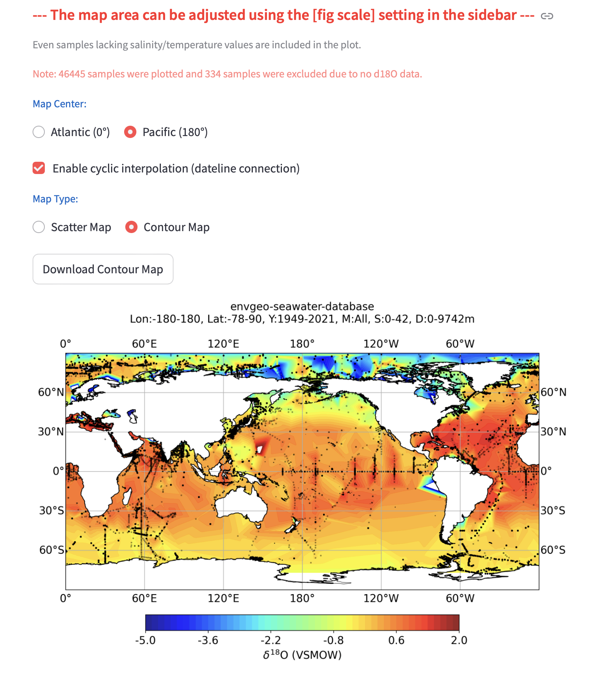
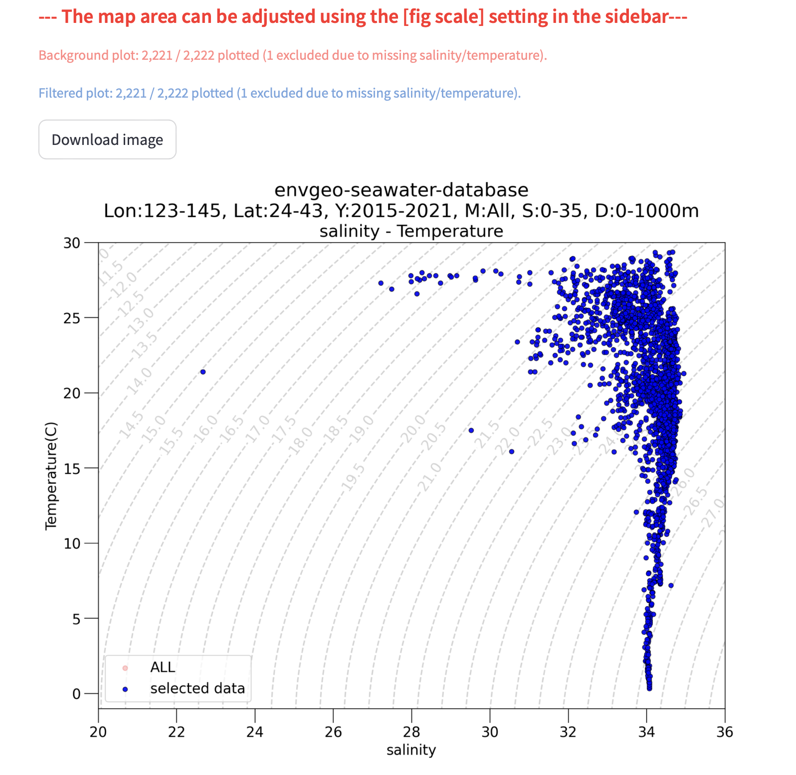
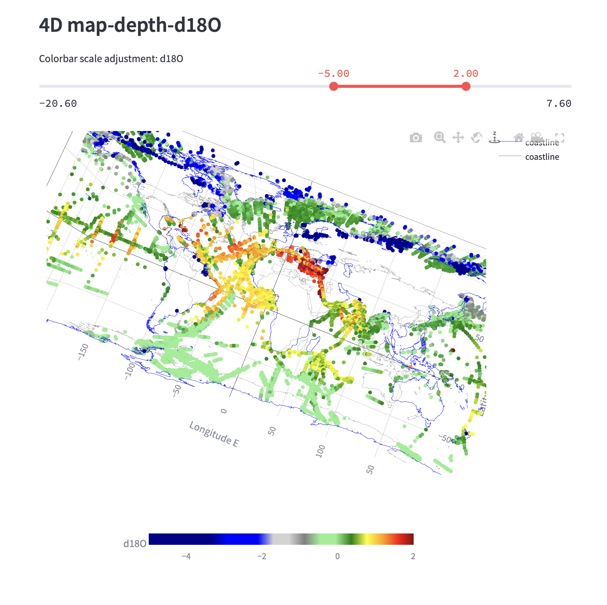
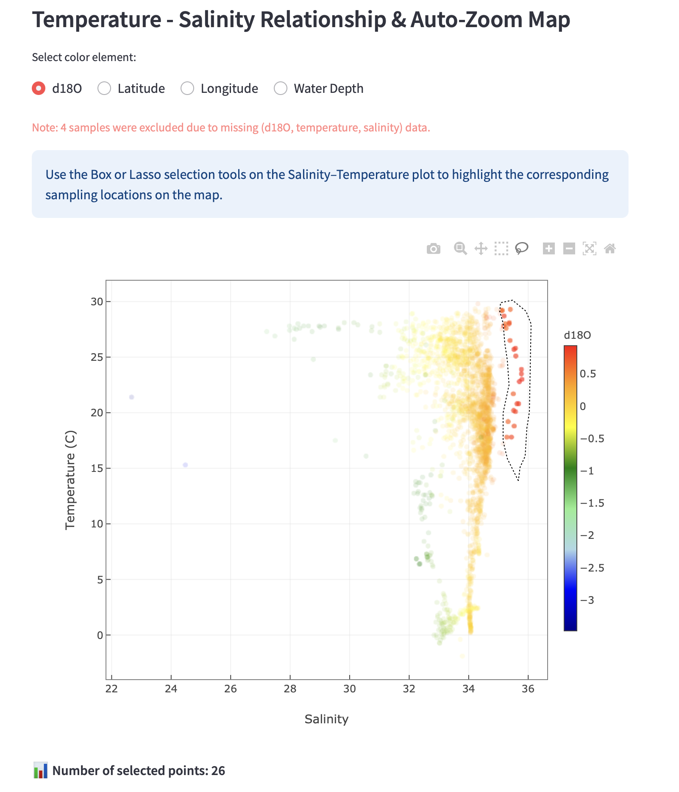
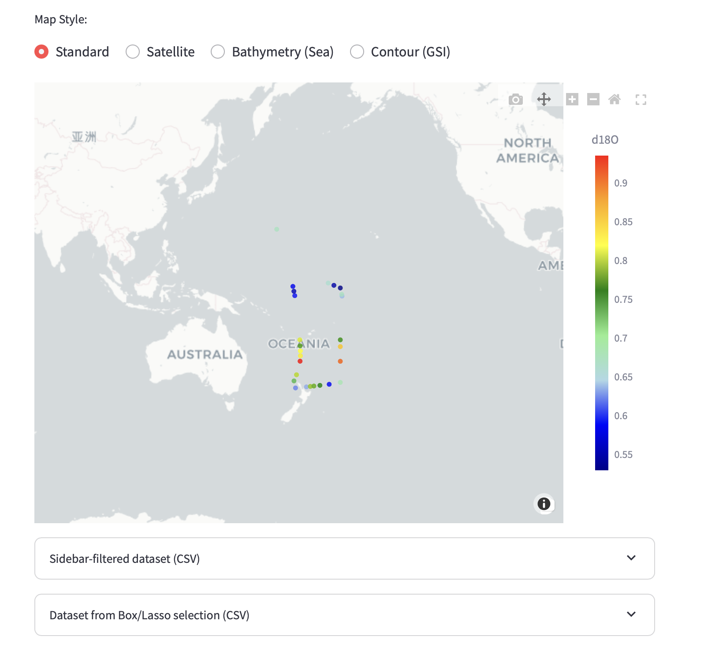

# EnvGeo-Seawater 利用ガイド

**Version 1.3.4** · 海水安定同位体・水文データの対話的な探索

[English](index.html) · [ソースリポジトリ](https://github.com/envgeo/seawater_map)

EnvGeo-Seawaterは、地域・全球の参照データセットとユーザー自身の観測データをあわせて、海水安定同位体と水文データを探索するためのアプリケーションです。本サイトでは、安定版でサポートする操作方法を説明します。

> 本アプリケーションは、対話的な探索と品質確認を目的としています。解析では、EnvGeo-Seawaterと利用した元データ提供者の両方を引用してください。

## 最初の操作

1. アプリケーションのサイドバーから可視化ページを開きます。
2. 参照データセットを選び、共通のデータ絞り込み条件を調整します。
3. **Apply settings** を選択して、表と図を更新します。
4. 地図、T–S空間、深度プロファイルなどを探索します。
5. 対応ページではCSVまたはXLSXをuploadできます。uploadしたデータは、そのsession内だけで扱われます。

## 操作ガイドを選ぶ

### まずはこちら

- [概要](manual_Japanese/00_overview.html)
- [データの絞り込み](manual_Japanese/01_data_filtering.html)
- [User Data Check & Quick Visualizer](manual_Japanese/05_user_data_check_quick_visualizer.html)

### インタラクティブな探索

- [Interactive 2Dplus Visualizer](manual_Japanese/03_2dplus_visualizer.html)
- [Interactive 3D/4D Visualizer](manual_Japanese/04_3d_4d_visualizer.html)

### 解析・図版作成

- [同位体・水文マッピング](manual_Japanese/32_isotope_hydrographic_mapping.html)
- [水温–塩分図](manual_Japanese/34_ts_diagram.html)
- [塩分–δ18O 関係](manual_Japanese/31_salinity_d18o.html)
- [カスタムパラメータプロット](manual_Japanese/35_custom_parameter_plot.html)
- [深度プロファイル](manual_Japanese/37_depth_profile.html)
- [鉛直断面可視化](manual_Japanese/53_vertical_section.html)

## データ・引用・サポート

- [データ出典と引用情報](https://github.com/envgeo/seawater_map/tree/main/data_text)
- [更新履歴](https://github.com/envgeo/seawater_map/blob/main/data_text/update_log_Japanese.md)
- [オフライン・通信不安定時の動作](offline_operation_log_Japanese.html)
- [テストと対応環境](testing_Japanese.html)
- [安定版の公開範囲](stable_release_publication_notes_Japanese.html)

## 図の例

以下の図は、安定版で利用できる探索的な表示例です。

### 全球同位体分布

統合した参照データセット（約50,000件）を用いた全球海水δ18Oのコンター図です。コンター補間は、海洋の大きな分布パターンや海盆スケールの変動を探索するための補助として用います。

### 水温–塩分図

T–S図には近似的なσ0参照等値線を重ねます。実用塩分を絶対塩分の近似、現場水温を保存温度の近似として用いるため、等値線は完全なTEOS-10計算の代替ではなく、参照のためのガイドです。

### 4D可視化

経度、緯度、水深、同位体情報を組み合わせ、空間勾配と鉛直構造をあわせて探索できます。

### 連動するインタラクティブ選択

T–S空間で選択したデータ群を地図上の採水位置と連動させ、選択した水塊の地理的な文脈を確認できます。

## 本サイトの対象範囲

本サイトでは、安定版でサポートする10ページの操作を扱います。歴史的な開発記録や除外した実験的ページは、安定版の利用者向け機能としては案内しません。
